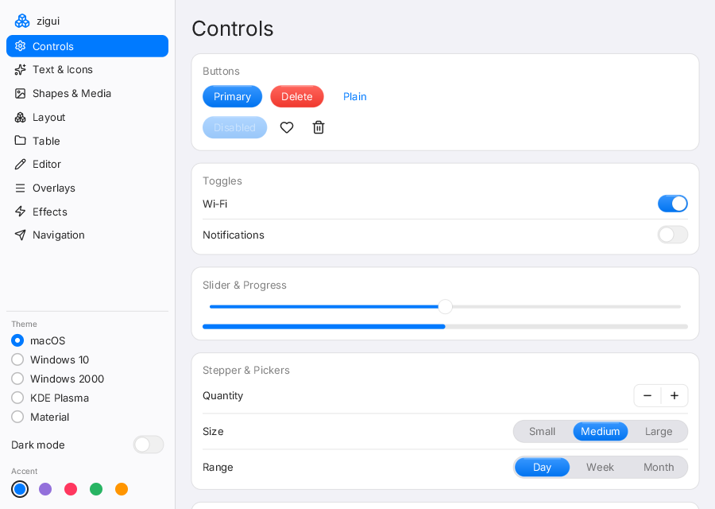
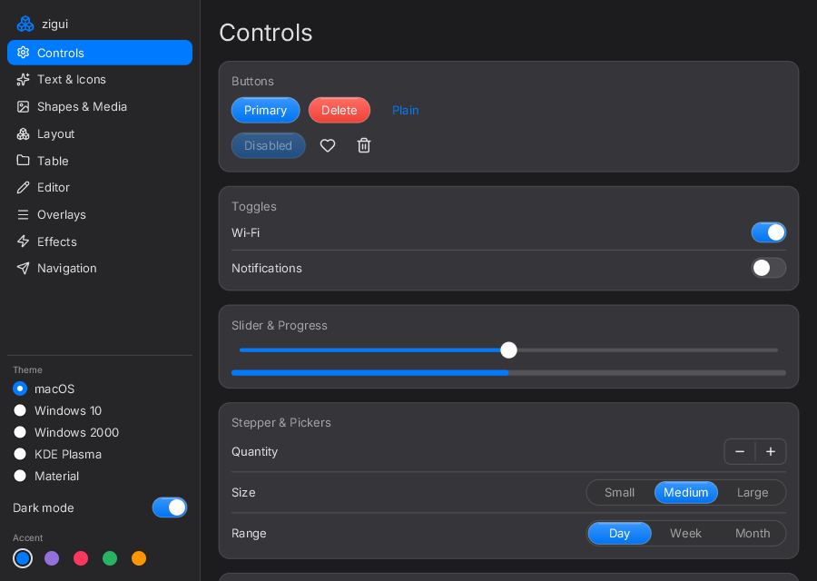
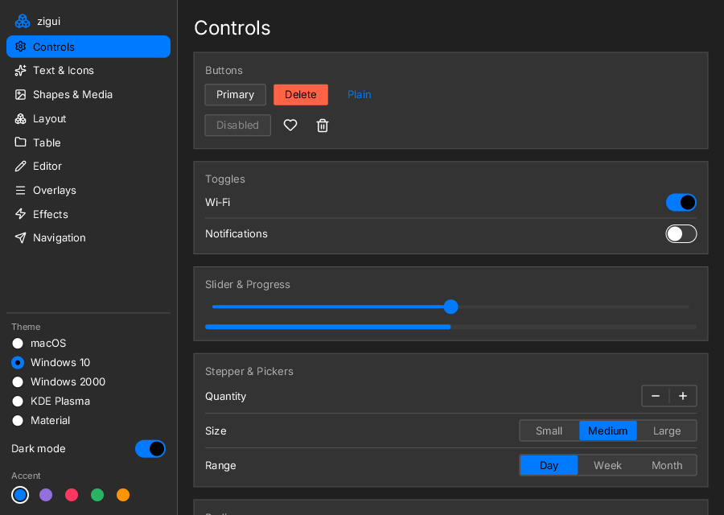
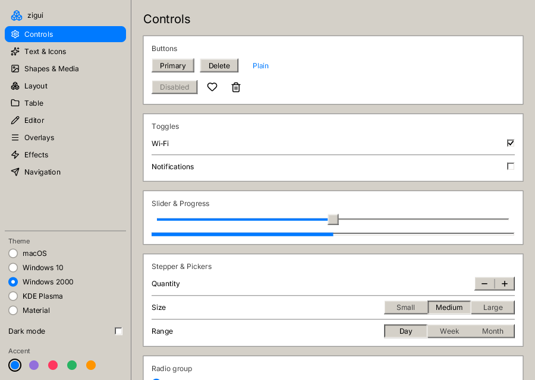
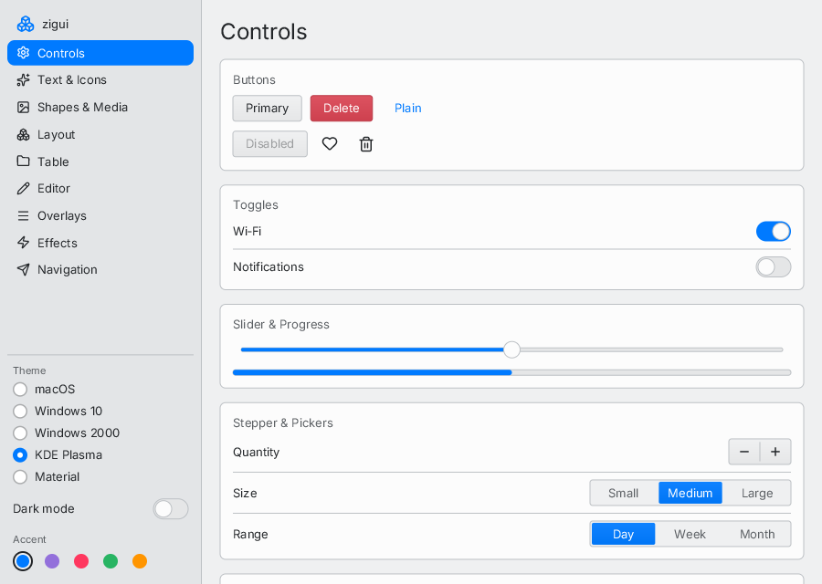
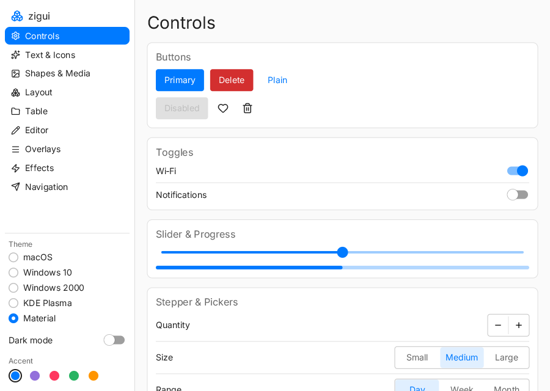
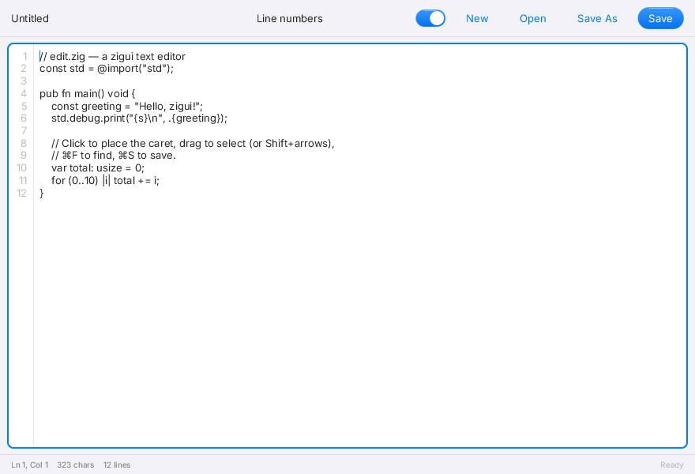
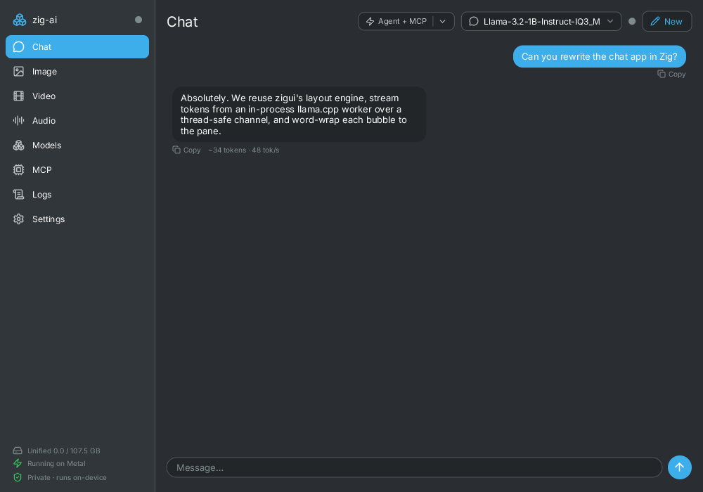

# zigui

A cross-platform, declarative UI library written in **pure Zig** that brings a
native macOS / SwiftUI look and feel to macOS, Linux, and Windows.

> Status: pre-alpha, but a usable toolkit. See [PRD.md](PRD.md) for the full
> design & roadmap.

## Screenshots

The `showcase` example, rendered in each built-in theme family:

| macOS (Liquid Glass, light) | macOS (Liquid Glass, dark) | Windows 10 (dark) |
|---|---|---|
|  |  |  |

| Windows 2000 | KDE Plasma (Breeze) | Material |
|---|---|---|
|  |  |  |

And the `edit` example — a multi-line text editor:



Every frame is the **same pure-Zig renderer** — no native widgets, themes are
just palettes + painters.

A real app built on zigui — [zig-ai](https://github.com/ddalcu/zig-ai), a local
chat/image/video/voice desktop app:



## Why

SwiftUI is the gold standard for ergonomic, good-looking native UI — but it is
Apple-only and closed. `zigui` delivers a SwiftUI-like developer experience and
macOS-like visual design on every desktop OS, using its **own rendering
pipeline** rather than wrapping native platform widgets. The same engine draws
on every platform, so output is identical everywhere.

## Hello, zigui

```zig
const zigui = @import("zigui");

fn body(st: *AppState) zigui.View {
    return zigui.VStack(.{
        zigui.Text("Hello, zigui!").font(.large_title),
        zigui.Text(zigui.components.fmt("Count: {d}", .{st.count.get()}))
            .foreground(zigui.default_theme.colors.secondary_label),
        zigui.Button("Increment", zigui.actionCtx(AppState, st, AppState.inc)),
    }).spacing(16).padding(40);
}
```

## Components

Layout: `VStack` `HStack` `ZStack` `Spacer` `Divider` `ScrollView` `List`
`ForEach` · Text/Media: `Text` `Label` `Image` `TextField` `TextEditor` ·
Controls: `Button` `Toggle` `Slider` `Stepper` `ProgressView` · Shapes:
`Rectangle` `RoundedRectangle` `Circle` `Capsule` `Ellipse` `LinearGradient`.

`TextEditor` is a multi-line, scrollable plain-text editor: line numbers, a
click-positionable caret, selection (mouse drag or Shift+arrows / Select-All),
tab stops, and wheel + caret-follow scrolling. See the [`edit`](examples/edit)
example.

Modifiers chain fluently: `.padding()` `.frame()` `.background()`
`.foreground()` `.font()` `.cornerRadius()` `.border()` `.opacity()` `.onTap()`
`.disabled()` `.frameMaxWidth()` …

## Themes

A `Theme` bundles a color `Palette`, a type scale, layout `Metrics`, and a
`Painter` (the vtable that draws every control's chrome). Five families ship —
**macOS** (Liquid Glass), **Windows 10** (flat/Fluent-lite), **Windows 2000**
(chiseled bevels), **KDE Plasma** (Breeze), and **Material** (Google Material
Design) — each as a light and dark theme. Pick one with
`themeForScheme(family, scheme)`, and follow the OS appearance by recomputing it
from `app.colorScheme()` inside a theme provider:

```zig
// Pick a family and resolve it for a color scheme.
const theme = zigui.themeForScheme(.macos, .dark); // ThemeFamily: .macos/.windows10/.win2000/.kde/.mui

// Follow the OS dark/light appearance live (SDL3 backend):
fn themeProvider() zigui.Theme {
    return zigui.themeForScheme(.macos, app.colorScheme()); // .light or .dark
}
// ...
app.setThemeProvider(themeProvider); // re-resolved each frame before the view builds
```

To author your own look, implement the `Painter` methods (`button`, `field`,
`slider`, `switchTrack`/`switchKnob`, `stepperBox`, `progress`, `segmented*`,
`panel`) — they draw only chrome into a `Surface`, never touching the view layer.

## Architecture at a glance

| Layer | Choice |
|---|---|
| API style | comptime/value declarative tree with fluent modifiers |
| State | observable `State(T)` + `Binding(T)` + dirty flag |
| Layout | two-pass measure/arrange engine (SwiftUI-style proposals) |
| Text | bundled Inter (OFL) + pure-Zig TrueType rasterizer + glyph cache |
| Theme | five families (macOS, Windows 10, Windows 2000, KDE Plasma, Material), light/dark, fully tokenized |
| 2D drawing | retained `Canvas` command list |
| Renderer (tests / headless) | **pure-Zig software rasterizer** (SDF anti-aliasing) |
| Renderer (on-screen) | **GPU via SDL_GPU** — Metal on macOS, Vulkan on Linux/Windows — with automatic software fallback |
| Windowing / input | **SDL3** |

The **core** (geometry, color, state, layout, theme, view tree, text, canvas,
software rasterizer, GPU scene translation, components) is pure Zig with **no C
dependencies** — the entire test suite runs headless on macOS, Linux, and
Windows.

> **Renderer note.** All drawing is expressed as a retained `Canvas` command
> list consumed by two backends that produce identical output: a pure-Zig
> software rasterizer (tests, headless, CI, machines without GPU drivers) and
> a GPU backend built on SDL3's GPU API (one unified instanced SDF pipeline +
> a glyph/image atlas + blur passes; Metal/Vulkan, no extra dependencies).
> Apps don't choose — the runtime picks the GPU when available and falls back
> silently (`ZIGUI_SOFTWARE=1` forces the software path).

## Use zigui in your project

zigui is distributed through Zig's built-in package manager — there's no central
registry, just a URL fetched and content-hashed into your `build.zig.zon`:

```sh
zig fetch --save git+https://github.com/ddalcu/zigui#v0.2.0
```

Then wire the module in your `build.zig`:

```zig
const zigui_dep = b.dependency("zigui", .{ .target = target, .optimize = optimize });
exe.root_module.addImport("zigui", zigui_dep.module("zigui"));
```

and `const zigui = @import("zigui");` in your code. The `zigui` module is **pure
Zig with no C dependencies** (the bundled Inter font travels with it). To put
pixels on screen, pair it with your own windowing/present loop, or start from the
SDL3 backend in [`src/app.zig`](src/app.zig) — SDL3 is only needed for display.

## Build & test

```sh
zig build test            # full test suite (headless — no GPU/window needed)
zig build test --summary all
zig build docs            # API docs into zig-out/docs
```

Run the demo apps (require SDL3 — `brew install sdl3` on macOS,
`apt install libsdl3-dev` on Linux):

```sh
zig build run-showcase               # the kitchen-sink gallery: every component,
                                     # light/dark + accent switchers (macOS 26 look)
zig build run-edit                   # a multi-line text editor (TextEdit/gedit-like)
zig build showcase edit              # build the examples without running them

# Render one frame to a BMP without a window (great for screenshots / CI);
# add --gpu to render it through the real GPU pipeline instead:
./zig-out/bin/showcase --screenshot out.bmp [section] [--dark] [--accent N] [--gpu]
```

> If the software fallback is in use, run with `-Doptimize=ReleaseFast` for
> smooth UI — the CPU rasterizer is much slower in the default Debug build.

### Validate on Linux via Docker

```sh
docker build -t zigui-test .   # downloads Zig, runs the full suite on Linux
```

Requires Zig 0.16.0+.

## Extending zigui

Adding a component or one of the planned features (navigation, tabs, modals,
grids, animation, materials/blur, accessibility, HiDPI)? See
**[CLAUDE.md](CLAUDE.md)** — it documents the architecture, the build/test
gotchas, the "add a component" recipe, and a concrete implementation plan (with
the exact code seams) for each deferred feature.

## License

MIT (see [LICENSE](LICENSE)). The bundled font **Inter** is under the SIL Open
Font License (see [assets/fonts/NOTICE.md](assets/fonts/NOTICE.md)). No Apple
assets are redistributed.
